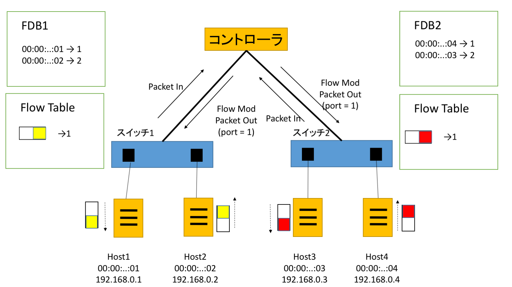

# 課題 (複数スイッチ対応版 ラーニングスイッチ)
##課題内容

複数スイッチに対応したラーニングスイッチ (multi_learning_switch.rb) の動作を説明しよう。

* 複数スイッチの FDB をどのように実現しているか、コードと動作を解説する
* 動作の様子やフローテーブルの内容もステップごとに確認すること
* 必要に応じて図解すること

##解答
###コードの解説
複数スイッチのFDBは，スイッチごとにFDBを作成する事で実現される．
スイッチのデータパスIDをキーとしたハッシュを作成し，オブジェクトをFDBクラスのインスタンスとする．  
以下にそのコードを表示する．

```
def start(_argv)
    @fdbs = {}
    logger.info 'MultiLearningSwitch started.'
  end

  def switch_ready(datapath_id)
    @fdbs[datapath_id] = FDB.new
  end
```
startハンドラで空のハッシュを作成し，switch\_readyハンドラで
データパスIDをキーとし，オブジェクトにはFDBをnewしたものを設定する．  
未知のパケットがきた場合はpacket\_inハンドラが呼ばれる．
基本的な動作は普通のlearning\_switchと同じであるが，FDBに保存する際に`@fdbs.fetch(datapath_id)`とすることでスイッチごとに生成したFDBを呼び出している．

```
def packet_in(datapath_id, message)
    return if message.destination_mac.reserved?
    @fdbs.fetch(datapath_id).learn(message.source_mac, message.in_port)
    flow_mod_and_packet_out message
end
```

また，未知のパケットの宛先のポート番号が登録されているかどうかを
確認するハンドラであるflow\_mod\_and\_packet\_outでもFDBを呼び指す際に``@fdbs.fetch(message.dpid)``としてスイッチ毎のFDBを呼び出している．

```
  def flow_mod_and_packet_out(message)
    port_no = @fdbs.fetch(message.dpid).lookup(message.destination_mac)
    flow_mod(message, port_no) if port_no
    packet_out(message, port_no || :flood)
  end
```

###動作の解説
以下にネットワークの構成イメージを示す．
2つのスイッチが一つのコントローラに接続されており，スイッチ1にホスト1，2が，スイッチ2にホスト3，4が接続されている．
#####ネットワーク構成イメージ

動作を確認するために以下の順序でパケットを送信した．

```
1.Host1からHost2へ また，Host3からHost4へパケットを送信
2.Host2からHost1へ また，Host4からHost3へパケットを送信
3.Host1からHost2へ また，Host3からHost4へパケットを送信
2.Host2からHost1へ また，Host4からHost3へパケットを送信
```
###1.Host1からHost2へ また，Host3からHost4へパケットを送信

Host1からHost2へパケットを送るとフローテーブルにはHost2へのパケットのポートが保存されていないのでパケットインが起こる．コントローラはFDB1を確認しHost2のポートを確認するが存在しないのでフラッディングでパケットアウトする．同時にFDB1にHost1のポート番号を登録する．Host3からHost4へも同様な処理が行われる．

以下に実行結果を示す．
```
$ ./bin/trema send_packets --source host1 --dest host2
$ ./bin/trema send_packets --source host3 --dest host4
$ ./bin/trema show_stats host1
Packets sent:
  192.168.0.1 -> 192.168.0.2 = 1 packet
$ ./bin/trema show_stats host2
Packets received:
  192.168.0.1 -> 192.168.0.2 = 1 packet
  
$ ./bin/trema show_stats host3
Packets sent:
  192.168.0.3 -> 192.168.0.4 = 1 packet
$ ./bin/trema show_stats host4
Packets received:
  192.168.0.3 -> 192.168.0.4 = 1 packet
```
###2.Host2からHost1へ また，Host4からHost3へパケットを送信

Host2からHost1へパケットを送るとフローテーブルにはHost1へのパケットのポートが保存されていないのでパケットインが起こる．FDB1にHost2のポート番号を登録する．コントローラはFDB1を確認しHost1のポートを確認しportが1番だとわかり，パケットアウトする．また，Host1へのパケットはポート番号1番だというフローモッドメッセージが送られ，フローテーブルに登録される．Host4からHost3へも同様な処理が行われる．

以下に実行結果を示す．
```
$ ./bin/trema send_packets --source host2 --dest host1
$ ./bin/trema send_packets --source host4 --dest host3
$ ./bin/trema show_stats host1
Packets sent:
  192.168.0.1 -> 192.168.0.2 = 1 packet
Packets received:
  192.168.0.2 -> 192.168.0.1 = 1 packet
$ ./bin/trema show_stats host2
Packets sent:
  192.168.0.2 -> 192.168.0.1 = 1 packet
Packets received:
  192.168.0.1 -> 192.168.0.2 = 1 packet
  
$ ./bin/trema show_stats host3
Packets sent:
  192.168.0.3 -> 192.168.0.4 = 1 packet
Packets received:
  192.168.0.4 -> 192.168.0.3 = 1 packet
$ ./bin/trema show_stats host4
Packets sent:
  192.168.0.4 -> 192.168.0.3 = 1 packet
Packets received:
  192.168.0.3 -> 192.168.0.4 = 1 packet
```

###3.Host1からHost2へ また，Host3からHost4へパケットを送信

Host1からHost2へパケットを送るとフローテーブルにはHost2へのパケットのポートが保存されていないのでパケットインが起こる．コントローラはFDB1を確認しHost2のポートを確認しportが2番だとわかり，パケットアウトする．また，Host2へのパケットはポート番号2番だというフローモッドメッセージが送られ，フローテーブルに登録される．Host3からHost4へも同様な処理が行われる．

以下に実行結果を示す．

```
$ ./bin/trema send_packets --source host1 --dest host2
$ ./bin/trema send_packets --source host3 --dest host4
$ ./bin/trema show_stats host1
Packets sent:
  192.168.0.1 -> 192.168.0.2 = 2 packet
Packets received:
  192.168.0.2 -> 192.168.0.1 = 1 packet
$ ./bin/trema show_stats host2
Packets sent:
  192.168.0.2 -> 192.168.0.1 = 1 packet
Packets received:
  192.168.0.1 -> 192.168.0.2 = 2 packet
  
$ ./bin/trema show_stats host3
Packets sent:
  192.168.0.3 -> 192.168.0.4 = 2 packet
Packets received:
  192.168.0.4 -> 192.168.0.3 = 1 packet
$ ./bin/trema show_stats host4
Packets sent:
  192.168.0.4 -> 192.168.0.3 = 1 packet
Packets received:
  192.168.0.3 -> 192.168.0.4 = 2 packet
```

###4.Host2からHost1へ また，Host4からHost3へパケットを送信

Host2からHost1へのパケットを送る．フローテーブルにはHost2へのパケットのポートが保存されているのでHost1のあるポート番号1に送られる．Host4からHost3へも同様な処理が行われる．

以下に実行結果を示す．

```
$ ./bin/trema send_packets --source host2 --dest host1
$ ./bin/trema send_packets --source host4 --dest host3
$ ./bin/trema show_stats host1
Packets sent:
  192.168.0.1 -> 192.168.0.2 = 2 packet
Packets received:
  192.168.0.2 -> 192.168.0.1 = 2 packet
$ ./bin/trema show_stats host2
Packets sent:
  192.168.0.2 -> 192.168.0.1 = 2 packet
Packets received:
  192.168.0.1 -> 192.168.0.2 = 2 packet
  
$ ./bin/trema show_stats host3
Packets sent:
  192.168.0.3 -> 192.168.0.4 = 2 packet
Packets received:
  192.168.0.4 -> 192.168.0.3 = 2 packet
$ ./bin/trema show_stats host4
Packets sent:
  192.168.0.4 -> 192.168.0.3 = 2 packet
Packets received:
  192.168.0.3 -> 192.168.0.4 = 2 packet
```